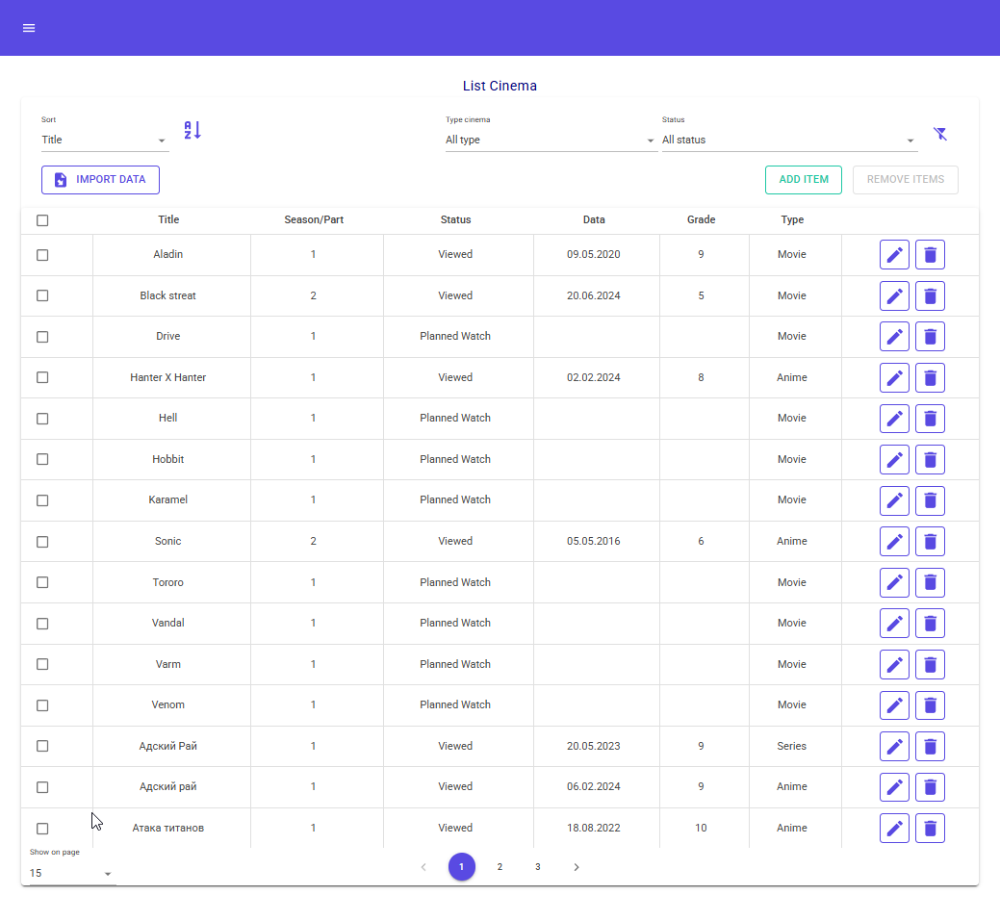

# WatchList 
This is a cross-platform application for keeping track of movies, TV series, anime and cartoons. 

## The user can:
- Add/Edit/Delete entries;
- Mark the viewing status (Planned, Viewed, Look, Thrown);
- Grade: Ability to grade (1-10) Viewed, Look, or Thrown titles;
- Filter and sort the table;
- Export and import data to/from a SQLite ".db" file.

## Multi-Platform: Access your collection via various interfaces:
- Windows Forms (WinForms);
- Windows Presentation Foundation (WPF);
- Avalonia (cross-platform UI for Desktop);
- Blazor WebAssembly (MudBlazor) for working in the browser.

### MudBlazor

  

### WinForms

  

### Avalonia

  

### WPF

  

### Technologies used:
- .NET 9 SDK;
- C# 11;
- Entity Framework Core (SQLite) — 9.0.1;
- ASP.NET Core MVC (+ NewtonsoftJson) — 9.0.1;
- WinForms (MaterialSkin-2) — 2.3.1;
- WPF:
    * CommunityToolkit.Mvvm — 8.4.0;
    * MahApps.Metro — 3.0.0-alpha0513;
    * MaterialDesignThemes & MaterialDesignColors — 5.2.1;
    * WPF-UI & WPF-UI.Tray — 3.0.5;
- Blazor WebAssembly (MudBlazor) — 8.2.0 (+ Bromix.MudBlazor.MaterialDesignIcons — 7.4.47.56);
- Avalonia — 11.2.3:
    * Avalonia.Xaml.Behaviors & Avalonia.Xaml.Interactions — 11.2.0.9;
    * Eremex.Avalonia.Controls — 1.1.99;
    * MessageBox.Avalonia (+ Markdown) — 3.2.0;
- Serilog:
    * Serilog.AspNetCore — 9.0.0;
    * Serilog.Sinks.Console & Serilog.Sinks.File — 6.0.0;
    * Serilog.Sinks.Debug (from Tests) — 3.0.0;
- Smart enums (Ardalis.SmartEnum) — 8.2.0;
- DI & Extensions — 9.0.1;
- Тестирование:
    * xUnit — 2.9.3;
    * Moq — 4.20.72;
    * FluentAssertions — 8.0.1;
- StyleCop.Analyzers — 1.1.118;
